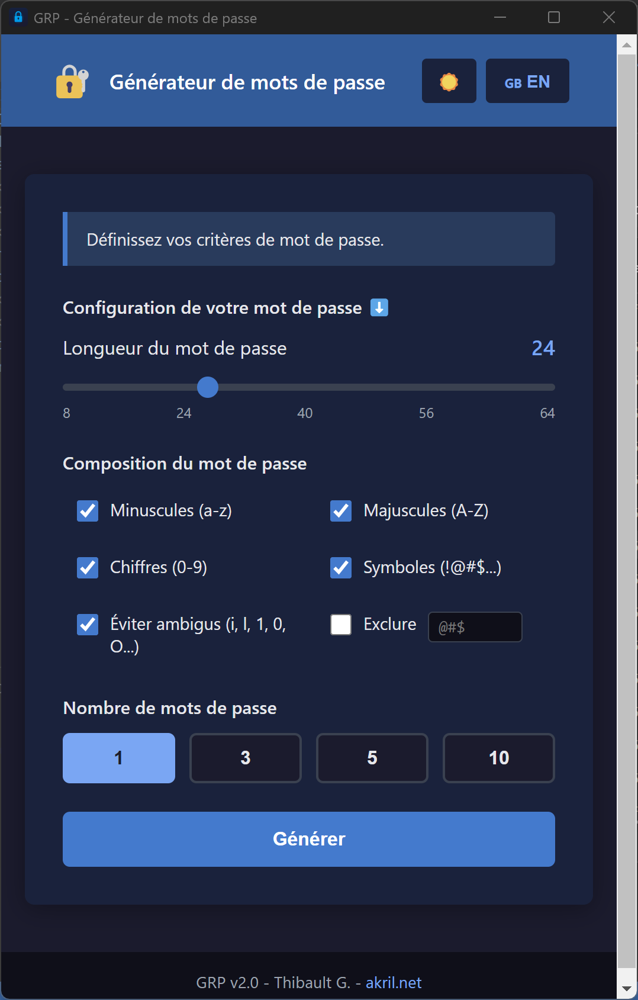
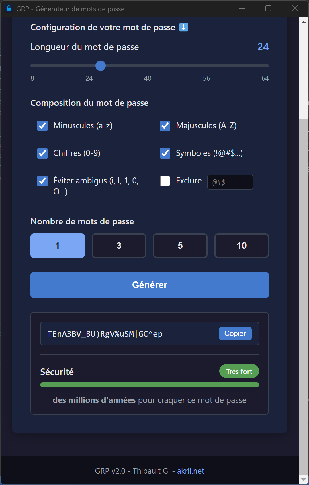

# GRP - Générateur de mots de passe v2.0

Cette application a pour vocation de **tester un développement qui serait compatible multi-plateforme et notamment macOS et Windows** avec 1 seul et unique développement.

Pour l'occasion, j'ai voulu utiliser une idée de petite application que j'avais développé en 2011 en .NET et en Java à l'époque : **un générateur de mots de passe**.

Version moderne du générateur de mots de passe, développé en React avec Vite.

L'objectif sera de packager cette application en mode **Electron** afin d'avoir une **compatibilité avec macOS + Windows** (et tout d'une manière générale). Principe de fonctionnement de grands outils comme VS Code, Notion, Discord, etc.

## Prérequis

- Docker & Docker Compose

## Lancement en développement

```bash
# Premier lancement (build + start)
docker compose up --build

# Lancements suivants
docker compose up
```

L'application sera accessible sur **http://localhost:5173**

## Structure du projet

```
password-generator/
├── docker-compose.yml    # Configuration Docker
├── Dockerfile            # Image Node.js
├── package.json          # Dépendances
├── vite.config.js        # Configuration Vite
├── index.html            # Point d'entrée HTML
└── src/
    ├── main.jsx          # Bootstrap React
    ├── App.jsx           # Composant principal
    └── styles.css        # Styles
```

## Fonctionnalités

- [x] Génération sécurisée (crypto.getRandomValues)
- [x] Choix de la longueur (4-64 caractères)
- [x] Options : minuscules, majuscules, chiffres, symboles
- [x] Copier en 1 clic
- [x] Génération multiple (comme la v1)
- [ ] Export TXT/Word/Excel (j'ai choisi de virer cette feature finalement)
- [x] Indicateur de force du mot de passe (fonctionnalité inspirée du générateur de Proton)
- [x] Traduction EN/FR en Vibe Coding
- [x] Reprise du mode jour / sombre

## Screenshots on Windows 11




